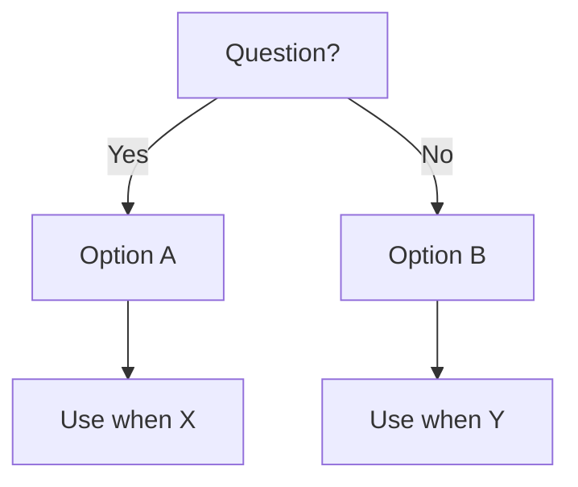
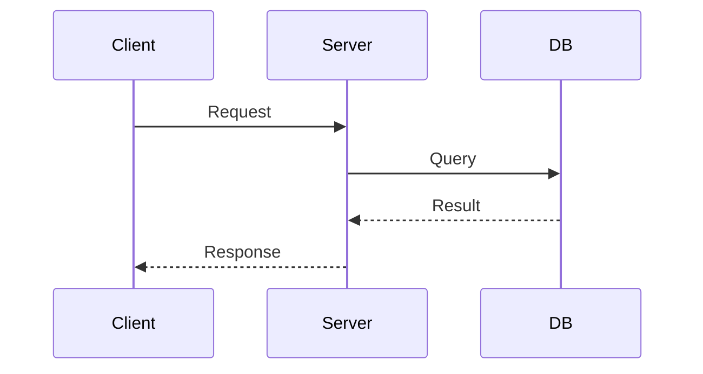

# Notes Enhancement Plan

**Goal:** Remove low-value reference content, make every note personal and opinionated, replace prose with visuals where possible, and add citations for credibility.

**Philosophy:** AI can answer "how does X work". Notes should answer "how I think about X" or "what I do when X". If a note is just a copy of docs, delete it.

---

## Principles for Every Note

1. **Remove** — anything a 5-second AI query answers better (syntax tables, generic how-it-works, copy-pasted content)
2. **Restructure** — lead with the key insight, use tables/diagrams over paragraphs
3. **Visualize** — replace linear text explanations with Mermaid diagrams, flowcharts, comparison tables
4. **Cite** — every factual claim that isn't personal experience should link to a source (RFC, paper, official docs, reputable article)

---

## Status Key

| Status | Meaning |
|--------|---------|
| ✅ Keep as-is | Already personal, well-structured, has visuals |
| 🔁 Enhance | Good bones, needs visuals/citations/restructure |
| ✂️ Trim | Remove generic sections, keep personal opinions |
| 🗑️ Delete | Pure reference — AI does it better |
| 🔀 Merge | Combine with another note |

---

## `docs/thinking/`

### Already Good
| File | Status | Notes |
|------|--------|-------|
| `principles.md` | ✅ Keep | Personal voice, clean structure |
| `career-development/ideal-working-environment.md` | ✅ Keep | Personal |

### Needs Work
| File | Status | Action |
|------|--------|--------|
| `7 Techniques to Overcomes Laziness.md` | 🔁 Enhance | Add personal commentary on each technique, add Mermaid wheel diagram (Ikigai), cite sources (Okinawa Blue Zone research, Pomodoro Technique paper) |
| `五维学习法.mdx` | 🔁 Enhance | Add visualization of the 5-dimension model, cite Feynman/learning science sources |
| `注意健康事项.md` | 🔁 Enhance | Group by category (sleep/diet/exercise/mental), add evidence-based citations |
| `关注同行大佬.md` | ✂️ Trim | Keep only names/links, remove generic advice |
| `books/人性的弱点.md` | 🔁 Enhance | Add personal takeaways per chapter, cite specific principles from Carnegie |
| `books/狼道.md` | 🔁 Enhance | Same treatment — personal lens, not summary |
| `interview/interview-questions.md` | ✂️ Trim | Remove generic Q&A that AI answers better, keep only personal answers/stories |
| `interview/practice.md` | ✅ Keep | Personal tracking |
| `interview/feedback.md` | ✅ Keep | Personal retrospectives |
| `career-development/roadmap.md` | ✅ Keep | Personal |
| `project-management/index.md` | 🔁 Enhance | Add RACI/timeline visuals, cite Agile Manifesto |
| `project-management/introduction.md` | 🔀 Merge | Merge into index.md |

---

## `docs/tech-notes/`

### Already Good
| File | Status | Notes |
|------|--------|-------|
| `system-design/index.md` | ✅ Keep | Has Mermaid diagram, tables, personal approach |
| `software-development/code-review.md` | ✅ Keep | Personal, has tables, blocking/non-blocking labels |
| `git/commit-format.mdx` | ✅ Keep | Personal convention with examples |

### Needs Enhancement (Visualize + Cite)
| File | Status | Action |
|------|--------|--------|
| `api/improve-api-performance.md` | 🔁 Enhance | **Fix broken image links** → replace with Mermaid sequence diagrams. Remove LinkedIn bold-font copy-paste. Add personal when-I-use-this sections. Cite RFC/ByteByteGo properly |
| `api/rest-api/index.md` | ✂️ Trim | Remove generic REST intro. Keep only opinions on REST vs GraphQL, versioning strategy I use |
| `api/api-security.md` | 🔁 Enhance | Add auth flow diagram (Mermaid), cite OWASP Top 10 |
| `api/idempotency.md` | 🔁 Enhance | Add sequence diagram showing idempotency key flow, cite Stripe's idempotency docs |
| `auth/index.md` | 🔁 Enhance | Add auth flow diagram: OAuth2/OIDC flow as Mermaid sequence |
| `auth/jwt/index.md` | ✂️ Trim | Remove "what is JWT" — keep only "how I use it" and gotchas |
| `auth/jwt/jwt-design.md` | 🔁 Enhance | Add claims diagram, cite JWT RFC 7519 |
| `database/index.md` | 🔁 Enhance | Add decision flowchart: SQL vs NoSQL, when to shard |
| `database/postgreSQL/index.md` | ✂️ Trim | Keep only personal setup preferences, remove generic docs |
| `http/index.md` | ✂️ Trim | Remove what-is-HTTP intro, keep request/response lifecycle diagram |
| `http/browser.md` | 🔁 Enhance | Add "what happens when you type a URL" sequence diagram (Mermaid) |
| `http/dns.md` | 🔁 Enhance | Add DNS resolution flowchart |
| `http/status-code.md` | ✂️ Trim | Keep only the ones I regularly confuse or misuse — not a full list |
| `programming-language/typescript/type-vs-interface.md` | 🔁 Enhance | Add comparison table + decision flowchart, cite TypeScript handbook |
| `programming-language/typescript/cheatsheet.md` | ✂️ Trim | Remove syntax AI can generate — keep only gotchas and patterns I keep forgetting |
| `programming-language/javascript/async-tech.md` | 🔁 Enhance | Add Promise/async-await flow diagram, cite MDN/spec |
| `lib-n-framework/react/state-management.md` | 🔁 Enhance | Add decision flowchart: useState vs useReducer vs Context vs Zustand/Redux |
| `lib-n-framework/react/hooks/useEffect.mdx` | ✂️ Trim | Remove generic docs content. Keep only the dependency array mental model + common mistakes |
| `lib-n-framework/next-js/next-js.mdx` | 🔁 Enhance | Add rendering strategy comparison table (SSR/SSG/ISR/CSR), cite Next.js docs |
| `design-patterns/index.md` | 🔁 Enhance | Add pattern decision diagram, cite Gang of Four categories |
| `ci-cd/index.md` | 🔁 Enhance | Add pipeline flow diagram (Mermaid), keep personal tool choices |
| `load-balancer/index.md` | 🔁 Enhance | Add traffic distribution diagram, cite nginx/HAProxy docs |
| `blockchain/intro.md` | ✂️ Trim | Remove generic intro, keep personal Web3 dev notes |

### Likely Delete (Pure Reference)
| File | Status | Reason |
|------|--------|--------|
| `http/url-uri/index.md` | 🗑️ Delete | Pure syntax reference |
| `http/internet/index.md` | 🗑️ Delete | Textbook content |
| `data-serialization-language/json.md` | 🗑️ Delete | AI knows JSON better than any note |
| `data-serialization-language/yaml.md` | 🗑️ Delete | Same |
| `database/postgreSQL/installation.md` | 🗑️ Delete | Use official docs |
| `database/postgreSQL/postgresql-string.md` | 🗑️ Delete | Cheat sheet AI can generate |
| `node/nvm/index.md` | 🗑️ Delete | nvm README is better |
| `tools/table2md.md` | 🗑️ Delete | One-liner reference |
| `coding-test/two-sum.mdx` | 🗑️ Delete | LeetCode is the source |
| `coding-test/sum-root.mdx` | 🗑️ Delete | Same |
| `coding-test/flatten-json.mdx` | 🗑️ Delete | Same — unless personal solution with commentary |

### Keep, Minor Touch
| File | Status | Notes |
|------|--------|-------|
| `git/commit-keyword.mdx` | ✅ Keep | Personal reference |
| `git/command-reference.mdx` | ✂️ Trim | Keep only commands you always forget, delete common ones |
| `ai/mcp/index.md` | ✅ Keep | Personal setup notes |
| `ai/aigc/index.md` | ✅ Keep | Personal |
| `tools/vs-code/extensions.md` | ✅ Keep | Personal list |
| `open-sources/index.md` | ✅ Keep | Curated list |

---

## Implementation Approach

Work file by file in this order (highest ROI first):

### Phase 1 — Delete the junk (quick wins)
Delete all `🗑️ Delete` files listed above. Update sidebars if needed.

### Phase 2 — Fix broken content
- Fix `api/improve-api-performance.md` (broken images → Mermaid diagrams)
- Fix `auth/jwt/` files (restructure + cite RFC 7519)

### Phase 3 — Enhance thinking/ notes
- `7 Techniques to Overcomes Laziness.md` — add Ikigai diagram + citations
- `注意健康事项.md` — group + cite
- Book notes — personal lens

### Phase 4 — Enhance core tech-notes
- TypeScript, JavaScript, React notes — trim + visualize
- System design additions (already good base)
- Database decision flowchart

### Phase 5 — Final pass
- Review all index/intro files — do they still make sense after deletes?
- Ensure each section has at least one note with a diagram

---

## Visualization Templates to Use

**Decision flowchart template:**

**Sequence diagram template:**

**Comparison table template:**
| Criteria | Option A | Option B |
|----------|----------|----------|
| Performance | ... | ... |
| Complexity | ... | ... |
| When to use | ... | ... |

---

## Citation Standards

- Official docs: link directly (e.g., `[JWT RFC 7519](https://datatracker.ietf.org/doc/html/rfc7519)`)
- Research/papers: author + title + year
- Engineering blogs: company + title (e.g., Stripe Engineering, AWS Architecture Blog)
- Avoid linking to tutorials — they go stale and aren't authoritative
