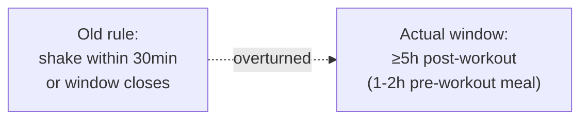

# Nutrient timing: two rules I dropped

I used to drink a shake within 30 minutes of finishing a session and treat a
missed pre-sleep casein dose as a wasted night. Both rules came from evidence
that's since been superseded or was conditional on something I don't have
(low daytime protein).

## The 30-minute anabolic window isn't real

Schoenfeld's 2013 meta-analysis plus follow-up 2024 work put the practical
post-workout window at 5h+ when a real meal was eaten 1-2h pre-workout —
narrower fasted, but still hours, not minutes.

What changed: I train fasted in the AM and eat 30g+ protein 1-2h after, not
in the car on the way home.

- Source: [Nutrient timing revisited, PMC](https://pmc.ncbi.nlm.nih.gov/articles/PMC3577439/) / [2024 protein timing meta-analysis](https://pmc.ncbi.nlm.nih.gov/articles/PMC12250900/)

## Pre-sleep casein isn't mandatory — it depends what you did earlier

Snijders 2015 and the older pre-sleep-protein studies were run against
insufficient daytime intake. Trommelen 2023 (see
[protein-and-energy](./protein-and-energy.md)) shows a single ~100g dose
covers 12h+ of MPS on its own — so if the day's total already hit 1.6g/kg+,
a separate pre-sleep dose isn't closing a real gap.

**When I still take it**: training late + under 2h to sleep. Then it's whey, not
casein — the point is a dose before sleep, not a specific protein type.

## Post-workout carbs: high-GI is for after training, not all day

High-GI carbs (white rice, white bread) refill glycogen ~1.5x faster than
low-GI. I use that window specifically — white rice post-workout, brown rice
everywhere else for steadier blood sugar.

## Sleep is the upstream lever, and it's not close

- One night of total sleep deprivation: MPS -18%, testosterone -24%, cortisol +21%
- Chronic 5-6h sleep: MPS down ~20%

7.5h is the floor I actually protect; 8h is the target. No amount of nutrient
timing compensates for this one.

- Source: [Sleep deprivation and MPS, PMC](https://pmc.ncbi.nlm.nih.gov/articles/PMC7785053/)

## The counter-argument I take seriously

"No mandatory pre-sleep protein" assumes the day's total already lands in the
1.6-2.2g/kg range. If a real day comes up short — travel, a skipped meal — the
old pre-sleep-casein rule is a reasonable patch, not a superstition. I use it
conditionally, not as a rule I deleted outright.
