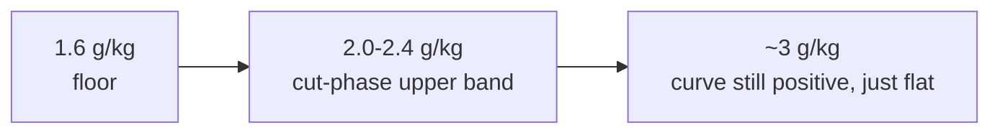

# Protein and energy: what changed my practice

I used to plan meals around a 40-50g per-meal protein cap and treat any deficit
past 500 kcal as reckless. Both were wrong, and the same 2023-2024 evidence
overturned them together — total protein and total energy matter more than the
schedule you hit them on.

## There's no per-meal cap

Trommelen et al. 2023 gave trained subjects 25g vs 100g whey in one sitting and
tracked muscle protein synthesis with stable isotopes for 12h. The 100g group
had *higher* total synthesis, sustained past 12h — no ceiling, no oxidized
excess. What changed for me: I stopped forcing a fourth meal just to avoid a
70g dinner. If a meal can carry 70g, it carries 70g.

- Source: [Trommelen et al. 2023, Cell Reports Medicine](https://www.cell.com/cell-reports-medicine/fulltext/S2666-3791(23)00540-2) ([PMC mirror](https://pmc.ncbi.nlm.nih.gov/articles/PMC10772463/))

## 1.6g/kg is where returns start dropping, not where they stop

Tagawa's 2020 meta-regression shows the dose-response curve for protein stays
positive up to ~3g/kg — it just flattens. 1.6-2.2g/kg is the practical
sweet spot; going to 2.0-2.4g/kg on a cut to protect lean mass is not
overconsumption, it's evidence-backed insurance.

- Source: [Tagawa et al. 2020, dose-response meta-analysis](https://academic.oup.com/nutritionreviews/article/79/1/66/5936522)

## Total beats distribution — so I quit forcing a fifth meal

3×50-70g and 5×30-40g are hypertrophy-equivalent when the daily total matches.
I used to schedule an afternoon snack purely to "hit five meals." I don't
anymore — a real snack only goes on the schedule when it's covering an actual
macro gap for that day.

## The energy floor that actually matters is BMR, not a fixed deficit number

| Deficit | What happens |
|---|---|
| < 300 kcal | slow lean gain still possible |
| 300-500 kcal | lean mass holds, hypertrophy stalls — my working cut range |
| > 500 kcal | linear lean mass loss starts |
| **below BMR** | muscle protein gets broken down for gluconeogenesis — this is the line, not the deficit size |

Losing >1% bodyweight/week is the earlier warning sign I actually watch, well
before the deficit number itself.

- Source: [Energy deficit and lean mass, PubMed](https://pubmed.ncbi.nlm.nih.gov/34623696/)

## The counter-argument I take seriously

The "no per-meal cap" result is one paper doing 12h isotope tracing on trained
subjects — it says the ceiling isn't 40-50g, it doesn't establish where a real
ceiling (if any) sits, and it doesn't cover untrained populations or very high
single doses (150g+). I'm treating it as "stop worrying about the 40g rule,"
not "protein has no upper bound at all."
