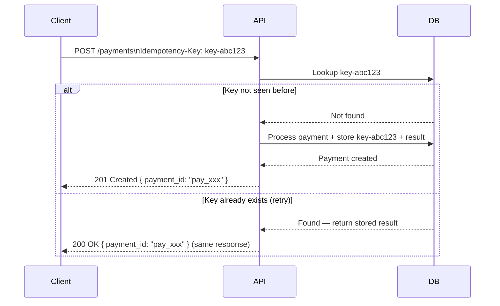

# Idempotency

An operation is idempotent if calling it N times produces the same result as calling it once.

**Why it matters:** Networks are unreliable. Clients retry on timeout. Without idempotency, a retry can create duplicate payments, double-send emails, or corrupt state.

---

## Which HTTP Methods Are Idempotent?

| Method | Idempotent? | Safe? | Notes |
|--------|-------------|-------|-------|
| `GET` | ✅ | ✅ | Read-only |
| `PUT` | ✅ | ❌ | Replace resource at URI |
| `DELETE` | ✅ | ❌ | Deleting twice = still deleted |
| `POST` | ❌ | ❌ | Creates new resource each time |
| `PATCH` | ❌* | ❌ | Depends on the operation |

*`PATCH` can be made idempotent if the operation is absolute (`set status = 'active'`), but not if it's relative (`increment count by 1`).

---

## The Idempotency Key Pattern

Used when `POST` must be made safe to retry (e.g. payment API):

**Implementation notes:**
- Key is client-generated (UUID), sent in a header or request body
- Store the key + response in DB/cache when first processed
- Return the same stored response on duplicates — don't re-execute
- Key TTL: 24h is Stripe's convention; match your retry window

---

## When I Implement This

I add idempotency keys any time:
- The operation creates or charges money
- The operation sends a notification (email, SMS, push)
- The operation triggers a webhook or external side effect
- The client is a mobile app with unreliable connectivity

Read-only endpoints don't need them — `GET` is already idempotent.

---

## Reference

- [Stripe — Idempotent Requests](https://stripe.com/docs/api/idempotent_requests)
- [REST API Design — Idempotency (HTTP RFC 9110)](https://www.rfc-editor.org/rfc/rfc9110#section-9.2.2)
