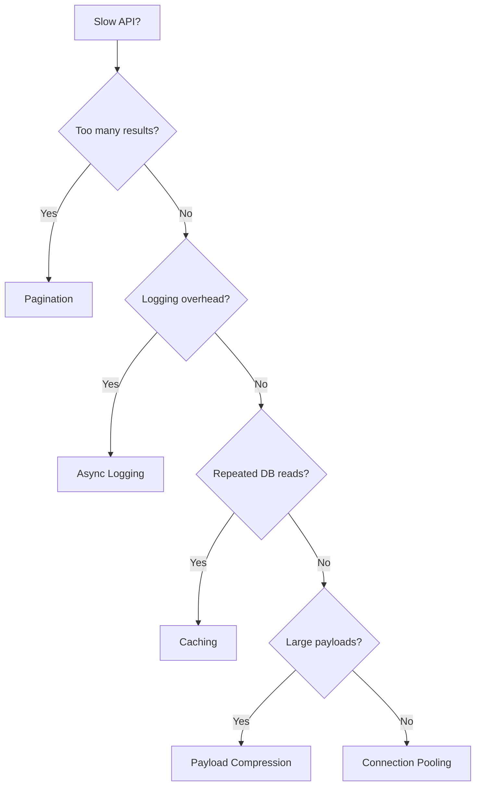
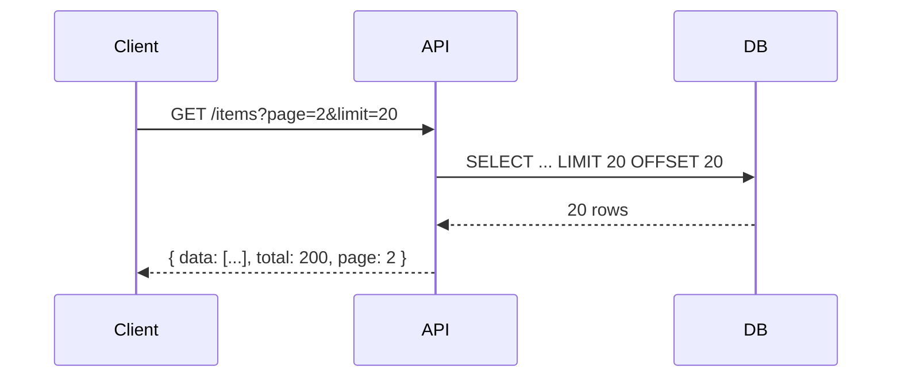
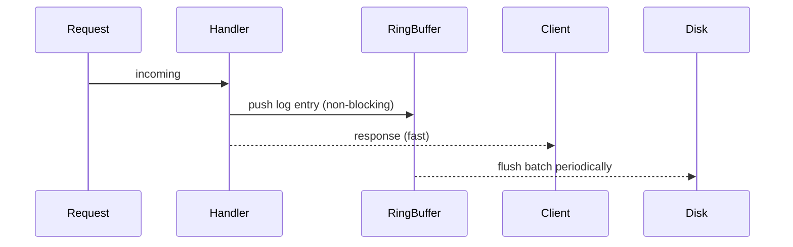
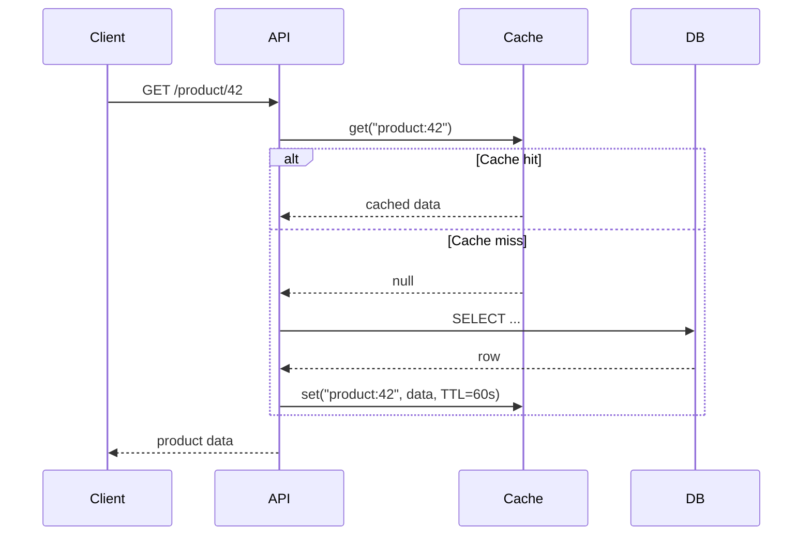
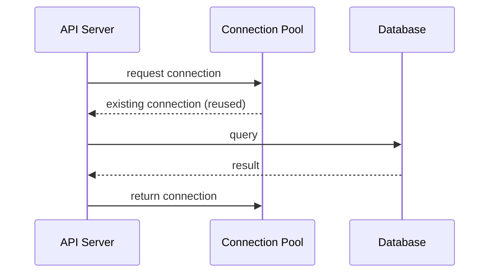

# Improve API Performance

Five techniques I reach for when an API is too slow. The right one depends on where the bottleneck is.

## The Five Techniques

---

## 1. Pagination

Return data in pages instead of all at once.

**When I use it:** Any list endpoint that could return more than ~50 rows. Default page size I pick: 20 for UI, 100 for bulk export.

Two styles:
- **Offset pagination** — simple, but slow on large offsets (`OFFSET 10000` scans 10k rows)
- **Cursor pagination** — use a stable cursor (e.g., `created_at + id`), better for infinite scroll and real-time data

---

## 2. Async Logging

Write logs to a lock-free ring buffer in memory, flush to disk on a background thread.

**When I use it:** High-throughput services where synchronous disk I/O adds measurable latency. Libraries like [Zap (Go)](https://github.com/uber-go/zap) do this by default.

---

## 3. Caching

Serve frequently-read data from memory instead of hitting the DB every time.

**When I use it:** Read-heavy, rarely-changing data — product catalogs, config, user profiles. I set short TTLs (60s–5min) and invalidate on write. Redis is my default.

**Gotcha:** Don't cache anything user-specific without namespacing the key by user ID.

---

## 4. Payload Compression

Compress response bodies with gzip or Brotli before sending.

**When I use it:** JSON responses over ~1KB, especially on slower mobile connections. Most frameworks enable this with one line:
- Express: `compression()` middleware
- Go/Gin: `gzip.Gzip(gzip.DefaultCompression)`
- Next.js: enabled by default in production

Typical savings: 60–80% on JSON. Not worth it for tiny responses (compression overhead > gains).

---

## 5. Connection Pooling

Reuse existing DB connections instead of opening a new one per request.

**When I use it:** Always. Opening a TCP connection + TLS + DB auth on every request is expensive (~10–50ms).

**Language gotcha:** Go/Java share a pool across goroutines/threads within one process. Node.js/PHP/Python spawn multiple processes — each process needs its own pool, which wastes connections. Fix: use a proxy like [PgBouncer](https://www.pgbouncer.org/) in front of Postgres to centralize pooling across all processes.

---

## Sources

- [ByteByteGo — Top 5 API Performance Optimization Tricks](https://bytebytego.com)
- [PgBouncer docs](https://www.pgbouncer.org/config.html)
- [Zap logger — Go](https://github.com/uber-go/zap)
