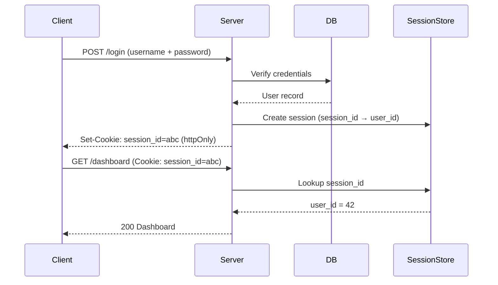
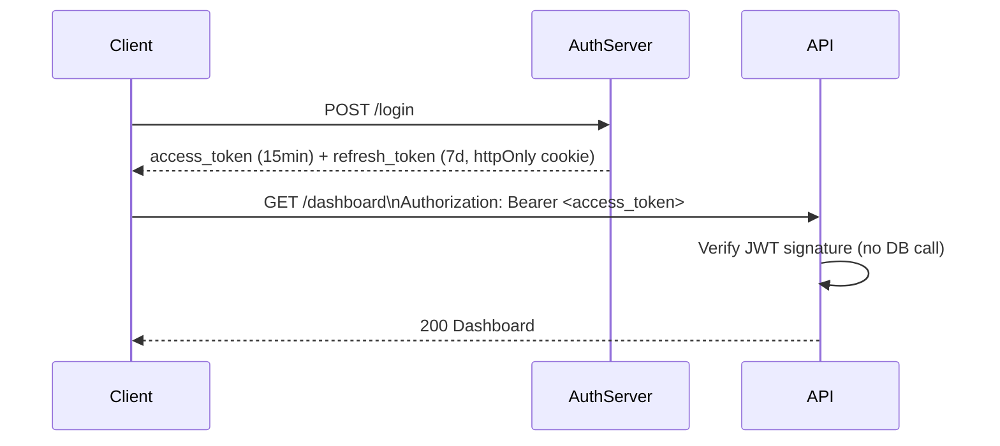
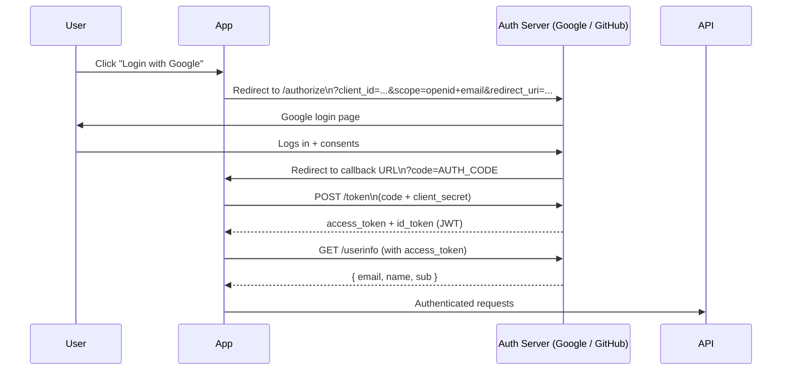

# Authentication

My mental model: **Authentication = who are you. Authorization = what can you do.**

---

## Auth Flow Comparison

### Session-based (cookie + server session)

### JWT-based (stateless)

---

## Session vs JWT

| | Session | JWT |
|-|---------|-----|
| State | Stored server-side | Stateless |
| Revocation | Instant (delete session) | Wait for expiry (or maintain revocation list) |
| Scalability | Needs shared session store (Redis) | Easy to scale horizontally |
| Mobile-friendly | Harder (cookie handling) | Better |
| My preference | Monolith + SSR apps | APIs, microservices, mobile |

---

## OAuth2 / OIDC Flow (for social login / SSO)

**OIDC** adds the `id_token` (user identity) on top of OAuth2 (API access). Use OIDC when you need to know *who* the user is, not just access their resources.

---

## My Default Stack

| Use case | My choice |
|----------|-----------|
| New Next.js app | NextAuth.js / Auth.js |
| Supabase project | Supabase Auth (built-in) |
| Backend API only | JWT (RS256) with short expiry |
| Enterprise SSO | SAML or OIDC via provider |

---

## Reference

- [OAuth 2.0 RFC 6749](https://www.rfc-editor.org/rfc/rfc6749)
- [OpenID Connect Core 1.0](https://openid.net/specs/openid-connect-core-1_0.html)
- [OWASP Authentication Cheat Sheet](https://cheatsheetseries.owasp.org/cheatsheets/Authentication_Cheat_Sheet.html)
