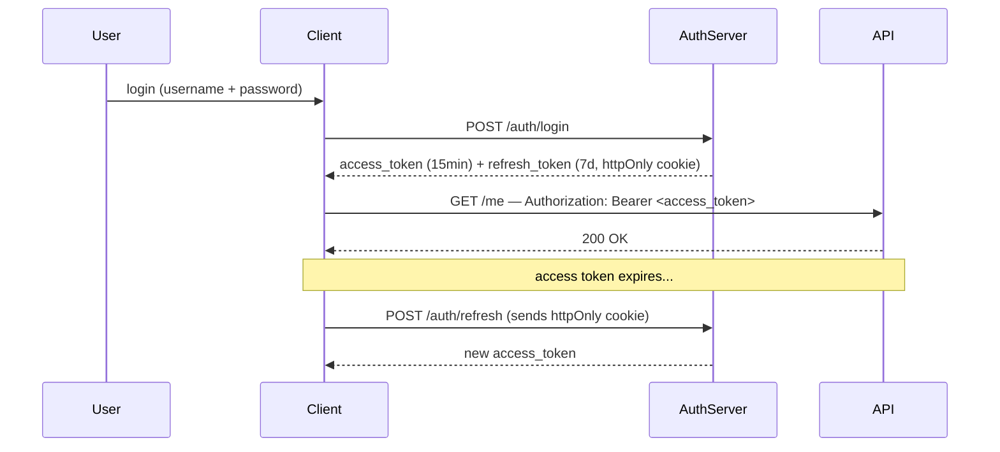

# JWT — How I Use It

> If you need "what is JWT" — read [RFC 7519](https://datatracker.ietf.org/doc/html/rfc7519). This note is about the decisions that matter in practice.

## My Token Strategy

**Access token:** short-lived (15 min), stored in memory (not localStorage).
**Refresh token:** long-lived (7 days), stored in `httpOnly` cookie — never accessible to JS.

---

## Storage Rules

| Location | XSS risk | CSRF risk | My verdict |
|----------|----------|-----------|------------|
| `localStorage` | High | None | Never for auth tokens |
| `sessionStorage` | High | None | Never for auth tokens |
| `httpOnly` cookie | None | Medium | OK for refresh tokens (add `SameSite=Strict`) |
| In-memory (JS var) | Low | None | Best for access tokens |

---

## Gotchas I've Hit

**1. JWT size bloat** — Every request sends the token. I've seen JWTs balloon to 1KB+ when people stuff roles, permissions, and user metadata in. Keep payload minimal: `sub`, `exp`, `iat`, and at most one or two app-specific claims.

**2. You can't revoke a valid JWT** — Until it expires, a stolen token is usable. Mitigations: short `exp`, revocation list via `jti` + Redis lookup, or just accept the tradeoff for low-risk endpoints.

**3. Algorithm confusion attacks** — Validate `alg` server-side. Never trust the algorithm from the token header alone. Use `RS256` for public-key scenarios (multi-service), `HS256` for single-service internal tokens.

**4. Clock skew** — Between issuing server and validating server. Add a small leeway (e.g., 30s) but don't go too wide.

---

## When I Reach for JWT vs Sessions

| | JWT | Session |
|-|-----|---------|
| Stateless APIs / microservices | ✅ | ❌ requires shared session store |
| Need instant revocation | ❌ | ✅ |
| Mobile clients | ✅ | OK |
| Monolith with Redis available | Either | ✅ simpler |

---

## Reference

- [JWT RFC 7519](https://datatracker.ietf.org/doc/html/rfc7519)
- [OWASP JWT Cheat Sheet](https://cheatsheetseries.owasp.org/cheatsheets/JSON_Web_Token_for_Java_Cheat_Sheet.html)
