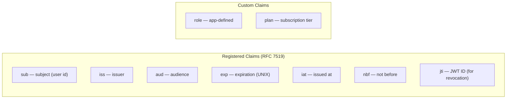

# JWT Design Reference

## Token Structure

```
eyJhbGciOiJIUzI1NiIsInR5cCI6IkpXVCJ9   ← Header (Base64URL)
.eyJzdWIiOiJ1c2VyXzEyMyIsImV4cCI6...   ← Payload (Base64URL)
.SflKxwRJSMeKKF2QT4fwpMeJf36POkx...    ← Signature
```

---

## Payload Claims



**Rule of thumb:** Registered claims first, minimal custom claims. Don't put PII or sensitive data — the payload is Base64-encoded, not encrypted.

### Example payload I use

```json
{
  "sub": "user_abc123",
  "iss": "https://api.myapp.com",
  "aud": "myapp-web",
  "exp": 1716667200,
  "iat": 1716663600,
  "role": "admin",
  "jti": "tok_xyz789"
}
```

---

## Algorithm Choice

| Algorithm | Type | Use when |
|-----------|------|----------|
| `HS256` | Symmetric (shared secret) | Single service, internal APIs |
| `RS256` | Asymmetric (private/public key) | Multiple services, public key distribution |
| `ES256` | Asymmetric (ECDSA, smaller keys) | Mobile-constrained environments |

**My default:** `RS256` for anything that crosses a service boundary. `HS256` for simple single-service setups where secret rotation is manageable.

Use **Key ID (`kid`)** in the header when rotating keys — consumers can fetch the right public key by ID.

---

## Access & Refresh Token Lifetimes

| Token | Lifetime | Storage |
|-------|----------|---------|
| Access token | 15 min | In-memory (JS) |
| Refresh token | 7 days | `httpOnly` cookie |

Short access token lifetimes limit blast radius on theft. Refresh tokens should be rotated on use (issue new one, invalidate old).

---

## Validation Checklist

Every token validation must check:
- [ ] Signature is valid
- [ ] `exp` > now (not expired)
- [ ] `iat` ≤ now (not issued in the future)
- [ ] `iss` matches your app's issuer
- [ ] `aud` matches your app's audience
- [ ] `nbf` ≤ now (if present)

Libraries: [`jose`](https://github.com/panva/jose) (JS/TS), [`golang-jwt/jwt`](https://github.com/golang-jwt/jwt) (Go).

---

## Common Mistakes

| Mistake | Why it's bad | Fix |
|---------|-------------|-----|
| `localStorage` for tokens | XSS can steal it | Use `httpOnly` cookie or memory |
| Long-lived access tokens | Stolen token valid for days | 15 min max |
| PII in payload | Payload is readable by anyone | Keep payload minimal |
| Trusting header `alg` | Algorithm confusion attacks | Enforce `alg` server-side |
| No key rotation | Compromised secret = all tokens compromised | Rotate with `kid` |

---

## Reference

- [JWT RFC 7519](https://datatracker.ietf.org/doc/html/rfc7519)
- [OWASP JWT Cheat Sheet](https://cheatsheetseries.owasp.org/cheatsheets/JSON_Web_Token_for_Java_Cheat_Sheet.html)
- [`jose` library (JS/TS)](https://github.com/panva/jose)
