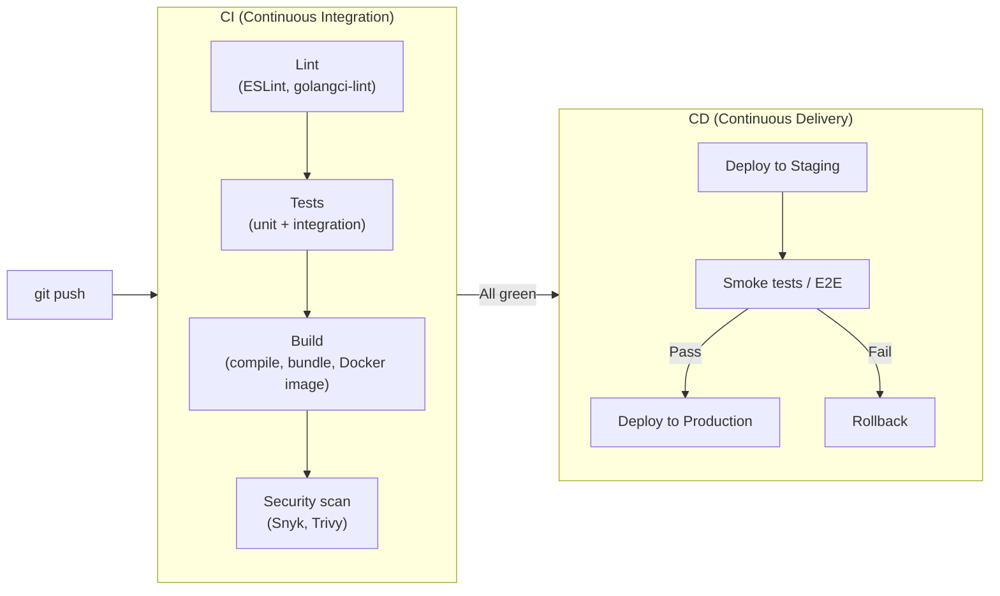

# CI/CD

Continuous Integration + Continuous Delivery. The goal: every commit is releasable.

---

## Pipeline Flow



---

## My Tool Choices

| Stage | Tool I use |
|-------|-----------|
| CI runner | GitHub Actions (most projects), Jenkins (enterprise) |
| Container build | Docker + GitHub Actions cache |
| Deployment | Vercel (Next.js), Render, or K8s + Helm |
| Secrets | GitHub Secrets / Vault |
| Notifications | Slack via Actions webhook |

---

## GitHub Actions Pattern I Reuse

```yaml
name: CI

on: [push, pull_request]

jobs:
  test:
    runs-on: ubuntu-latest
    steps:
      - uses: actions/checkout@v4
      - uses: actions/setup-node@v4
        with:
          node-version: '20'
          cache: 'npm'
      - run: npm ci
      - run: npm run lint
      - run: npm test
      - run: npm run build
```

**Key decisions I always make:**
- Cache dependencies (`cache: 'npm'`) — saves 30–60s per run
- Run lint before tests — fails fast on style issues
- `npm ci` not `npm install` — reproducible installs from lockfile

---

## Deployment Strategies

| Strategy | How | Zero downtime | Risk |
|----------|-----|---------------|------|
| Rolling update | Replace instances one at a time | ✅ | Medium |
| Blue/Green | Switch traffic from old to new env | ✅ | Low (easy rollback) |
| Canary | Route % of traffic to new version | ✅ | Low (gradual rollout) |
| Recreate | Stop all old, start all new | ❌ | High (downtime) |

**My default:** Rolling update for simple services, Blue/Green when I need instant rollback.

---

## Reference

- [GitHub Actions Documentation](https://docs.github.com/en/actions)
- [Continuous Delivery — Jez Humble & David Farley (2010)](https://continuousdelivery.com/)
