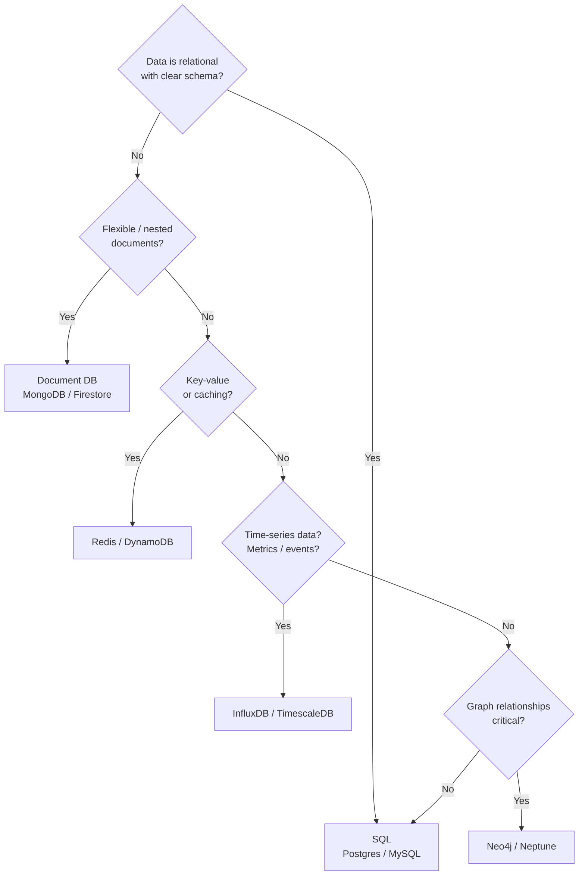
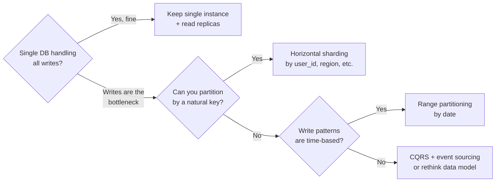

# Database

My decision process for picking a database. The default is Postgres unless there's a good reason to deviate.

---

## SQL vs NoSQL Decision

**Default: Postgres.** It handles relational data, JSONB for flexible fields, full-text search, and time-series (with TimescaleDB extension). Don't switch until Postgres is actually the bottleneck.

---

## When to Shard

**My rule:** Add read replicas before sharding. Shard only when write throughput is the bottleneck and you have a clean partition key. Sharding adds enormous operational complexity.

---

## Indexing Rules I Follow

- Index foreign keys and any column used in `WHERE`, `JOIN`, or `ORDER BY`
- Composite indexes: column order matters — put the most selective column first
- Partial indexes for common filtered queries (e.g. `WHERE status = 'pending'`)
- Don't over-index: each index slows writes and uses storage
- Run `EXPLAIN ANALYZE` before assuming an index helps

---

## Transactions and ACID

| Property | Meaning | Why it matters |
|----------|---------|----------------|
| **A**tomicity | All or nothing | No partial writes |
| **C**onsistency | DB stays in valid state | Constraints enforced |
| **I**solation | Concurrent transactions don't interfere | No dirty reads |
| **D**urability | Committed = persisted | Survives crashes |

**Default isolation level:** `READ COMMITTED` (Postgres default). Use `SERIALIZABLE` only for financial transactions where correctness is critical.

---

## Reference

- [Postgres Documentation](https://www.postgresql.org/docs/)
- [Use The Index, Luke — SQL indexing guide](https://use-the-index-luke.com/)
- [Designing Data-Intensive Applications — Kleppmann (2017)](https://dataintensive.net/)
