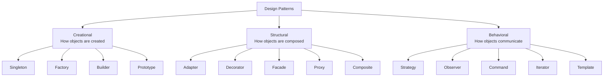
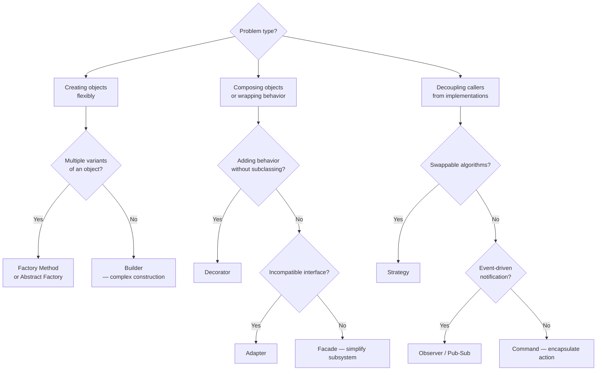

# Design Patterns

Patterns are named solutions to recurring design problems. The value is the shared vocabulary — "use a Strategy here" communicates more than describing the implementation.

---

## Pattern Categories (GoF)



---

## When to Reach for What



---

## Patterns I Actually Use

### Strategy

Swap algorithms at runtime without changing the caller.

```ts
interface SortStrategy {
  sort(data: number[]): number[];
}
class QuickSort implements SortStrategy { ... }
class MergeSort implements SortStrategy { ... }

class Sorter {
  constructor(private strategy: SortStrategy) {}
  sort(data: number[]) { return this.strategy.sort(data); }
}
```

**I use it for:** payment processors, file export formats, notification channels.

---

### Observer

One object notifies many subscribers when its state changes.

```ts
// In React: useEffect + event emitters
// In Node: EventEmitter
// In Go: channels
```

**I use it for:** React state → UI sync, webhook fan-out, real-time event broadcasts.

---

### Facade

Simplify a complex subsystem behind a single interface.

```ts
// Instead of: new S3Client → PutObjectCommand → await → handle errors
// Wrap into:
const storage = new FileStorage();
await storage.upload(key, buffer);
```

**I use it for:** third-party SDK wrappers, domain service layers.

---

### Repository

Abstract data access behind an interface. Swap storage implementations without touching business logic.

```ts
interface UserRepository {
  findById(id: string): Promise<User | null>;
  save(user: User): Promise<void>;
}
```

**I use it for:** any service that touches a DB — makes testing easier (mock the repo, not the DB).

---

## Patterns I Avoid Overusing

- **Singleton** — creates hidden global state. Use dependency injection instead.
- **Abstract Factory** — often overkill; Strategy + simple factory usually enough.
- **Chain of Responsibility** — middleware pipelines are cleaner in most web frameworks.

---

## Reference

- [Refactoring Guru — Design Patterns](https://refactoring.guru/design-patterns)
- [Gang of Four — Design Patterns (1994)](https://en.wikipedia.org/wiki/Design_Patterns)
