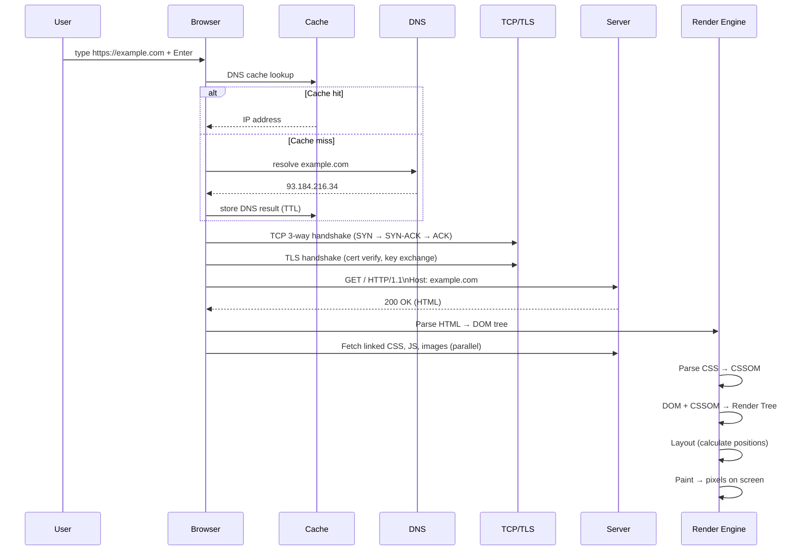

# What Happens When You Type a URL

The full lifecycle — from keypress to painted pixels.

---

## The Stages That Matter for Performance

| Stage | What it is | How to speed it up |
|-------|------------|-------------------|
| DNS lookup | Translating domain → IP | Use `dns-prefetch` hints, CDN with anycast |
| TCP + TLS | Connection setup | HTTP/2 multiplexing, keep-alive, QUIC/HTTP/3 |
| Server response | Time to first byte (TTFB) | Fast backend, CDN edge caching |
| HTML parse + sub-resources | Critical render path | Defer non-critical JS, inline critical CSS |
| Layout + paint | Render engine work | Avoid layout thrashing, use `will-change` sparingly |

**The metric I watch most:** TTFB (Time To First Byte) tells me if the problem is DNS/network vs server-side.

---

## Reference

- [How Browsers Work — web.dev](https://web.dev/articles/howbrowserswork)
- [Critical Rendering Path — MDN](https://developer.mozilla.org/en-US/docs/Web/Performance/Critical_rendering_path)
