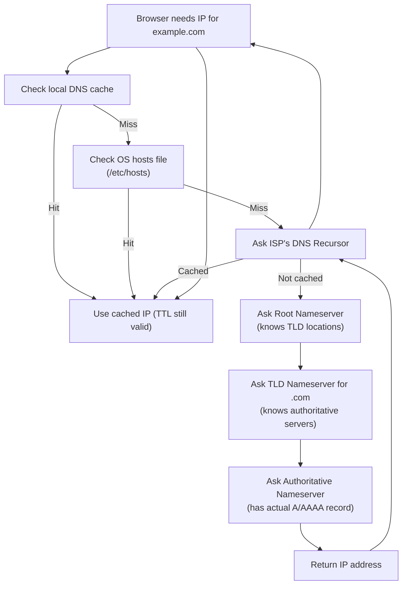

# DNS Resolution

DNS translates a domain name (`example.com`) into an IP address (`93.184.216.34`) so the browser knows where to connect.

## Resolution Flowchart

## The Four Servers

| Server | Role | Example |
|--------|------|---------|
| Recursor | Your ISP or resolver (e.g. 8.8.8.8) — asks on your behalf | Google DNS, Cloudflare 1.1.1.1 |
| Root Nameserver | Knows where TLD servers are — 13 root server clusters globally | a.root-servers.net |
| TLD Nameserver | Knows authoritative servers for `.com`, `.io`, etc. | Verisign for `.com` |
| Authoritative Nameserver | Has the actual records for your domain | Your registrar / Route53 / Cloudflare |

## Common DNS Record Types

| Record | Purpose | Example |
|--------|---------|---------|
| `A` | Domain → IPv4 | `example.com → 93.184.216.34` |
| `AAAA` | Domain → IPv6 | `example.com → 2606:2800::1` |
| `CNAME` | Alias to another domain | `www → example.com` |
| `MX` | Mail server for domain | `example.com → mail.example.com` |
| `TXT` | Arbitrary text (SPF, DKIM, verification) | SPF record |
| `NS` | Authoritative nameservers for domain | `ns1.cloudflare.com` |

## TTL and Caching

DNS results are cached at each layer for the duration of the **TTL (Time To Live)** set on the record.

- Low TTL (60–300s): faster failover, but more DNS queries
- High TTL (3600–86400s): fewer queries, slower propagation of changes

**My rule:** Keep TTL low when a change is coming (migration, failover), then raise it after the change is stable.

---

## Reference

- [Cloudflare — What is DNS?](https://www.cloudflare.com/en-gb/learning/dns/what-is-dns/)
- [RFC 1034 — Domain Names Concepts](https://www.rfc-editor.org/rfc/rfc1034)
