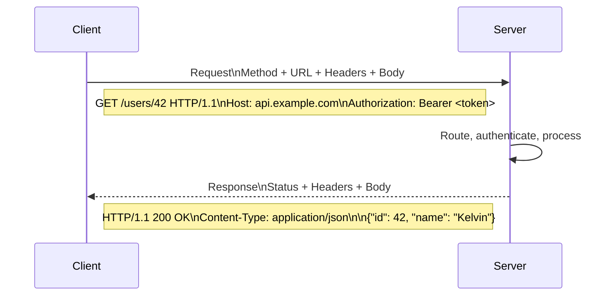

# HTTP

HTTP is a request-response protocol over TCP/IP. Every browser interaction, API call, and webhook is an HTTP exchange.

## Request / Response Lifecycle

## The Parts I Care About

### Request
- **Method** — verb: what you want to do (`GET`, `POST`, `PUT`, `PATCH`, `DELETE`)
- **URL** — where: resource identifier
- **Headers** — metadata: auth, content type, caching hints
- **Body** — payload (only for `POST`/`PUT`/`PATCH`)

### Response
- **Status code** — result code (see [HTTP Status Codes](./status-code.md))
- **Headers** — metadata: cache control, content type, rate limit info
- **Body** — response data (JSON, HTML, etc.)

## HTTP/1.1 vs HTTP/2 vs HTTP/3

| | HTTP/1.1 | HTTP/2 | HTTP/3 |
|-|----------|--------|--------|
| Multiplexing | ❌ (one request/connection) | ✅ | ✅ |
| Header compression | ❌ | ✅ HPACK | ✅ QPACK |
| Transport | TCP | TCP | QUIC (UDP) |
| TLS required | Optional | Optional (but browsers require it) | Yes |
| Head-of-line blocking | Yes | Yes (at TCP level) | ❌ (QUIC eliminates it) |

**My default:** HTTP/2 for all new services — it's the baseline in modern infrastructure (nginx, AWS ALB, Cloudflare all support it). HTTP/3 is opt-in where latency is critical (mobile, global CDN edge).

---

## Reference

- [MDN — HTTP Overview](https://developer.mozilla.org/en-US/docs/Web/HTTP/Overview)
- [HTTP/2 RFC 7540](https://www.rfc-editor.org/rfc/rfc7540)
- [HTTP/3 RFC 9114](https://www.rfc-editor.org/rfc/rfc9114)
