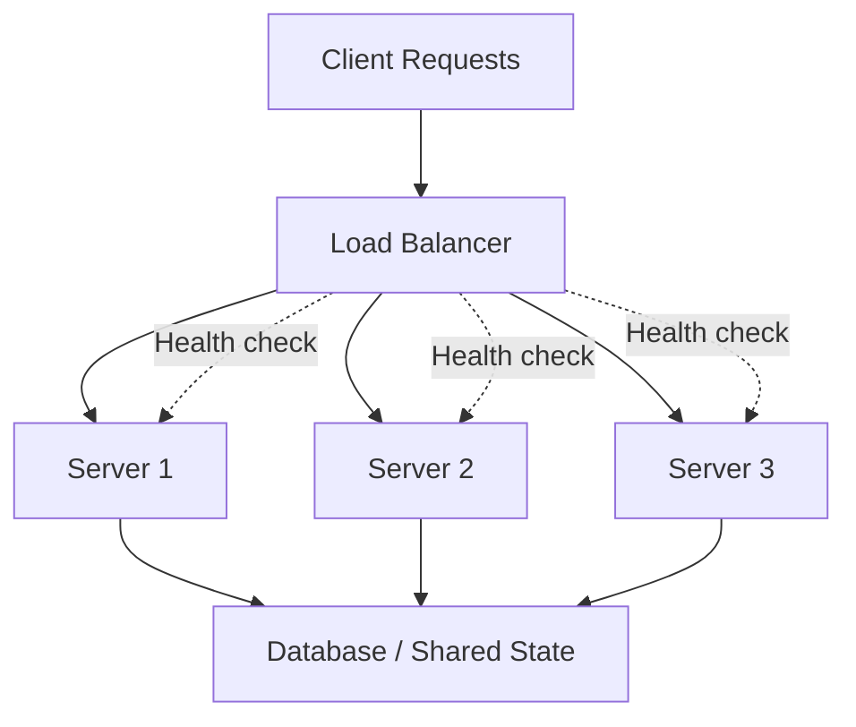

# Load Balancer

Distributes incoming traffic across multiple backend servers so no single server becomes a bottleneck.

---

## Traffic Distribution

The load balancer health-checks each server continuously. Unhealthy servers are automatically removed from rotation.

---

## Algorithms

| Algorithm | How it works | When to use |
|-----------|-------------|-------------|
| **Round Robin** | Rotate through servers in order | Servers are roughly equal capacity |
| **Least Connections** | Send to server with fewest active connections | Long-lived requests (WebSocket, uploads) |
| **IP Hash** | Hash client IP → always same server | Session stickiness without shared session store |
| **Weighted Round Robin** | Round robin, but some servers get more traffic | Mixed capacity servers |
| **Random** | Pick a random server | Simple, surprisingly effective at scale |

**My default:** Round Robin for stateless APIs. Least Connections for WebSocket services. IP Hash only when I can't use a shared session store.

---

## L4 vs L7 Load Balancing

| | L4 (Transport Layer) | L7 (Application Layer) |
|-|---------------------|------------------------|
| Routes by | IP + TCP port | HTTP headers, URL path, cookies |
| TLS termination | ❌ (passes through) | ✅ (inspects content) |
| Content-based routing | ❌ | ✅ (`/api/*` → API servers, `/*` → web servers) |
| Performance | Faster (less inspection) | More flexible |
| Example | AWS NLB, HAProxy TCP mode | nginx, AWS ALB, Traefik |

**My default:** L7 (ALB / nginx) for web apps — path-based routing and TLS termination are worth it.

---

## My Tool Choices

| Context | Tool |
|---------|------|
| Cloud (AWS) | ALB (L7) or NLB (L4) |
| Self-hosted / K8s | nginx or Traefik |
| Edge / CDN | Cloudflare |
| Dev environment | nginx or Caddy |

---

## Reference

- [nginx Load Balancing](https://nginx.org/en/docs/http/load_balancing.html)
- [HAProxy Configuration Manual](https://www.haproxy.org/#docs)
- [AWS Application Load Balancer](https://docs.aws.amazon.com/elasticloadbalancing/latest/application/introduction.html)
