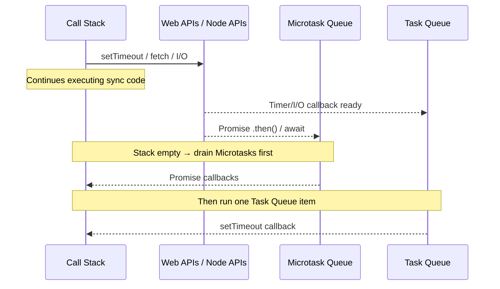

# JavaScript Async

JavaScript is single-threaded but non-blocking. The engine offloads I/O to the browser/Node runtime and resumes via the event loop.

## The Event Loop (simplified)



**Key rule:** Microtasks (Promises) always drain before the next Task Queue item runs. This is why `Promise.resolve().then(...)` runs before `setTimeout(() => ..., 0)`.

---

## The Three Patterns

### Callbacks (avoid in new code)

```js
fs.readFile('file.txt', (err, data) => {
  if (err) throw err;
  processData(data, (err, result) => { // callback hell
    ...
  });
});
```

Problem: error handling is inconsistent, nesting gets out of hand fast.

### Promises

```js
fetch('/api/user')
  .then(res => res.json())
  .then(user => console.log(user))
  .catch(err => console.error(err));
```

Better for chaining, but `.then()` chains still get verbose.

### Async/Await (my default)

```js
async function getUser(id) {
  try {
    const res = await fetch(`/api/user/${id}`);
    if (!res.ok) throw new Error(`HTTP ${res.status}`);
    return await res.json();
  } catch (err) {
    console.error('Failed to fetch user:', err);
    throw err; // re-throw so caller can handle
  }
}
```

Reads like synchronous code. Always pair with `try/catch` — unhandled promise rejections are silent in some environments.

---

## Patterns I Actually Use

### Parallel fetches

```js
// Sequential (slow — waits for each)
const user = await getUser(id);
const posts = await getPosts(id);

// Parallel (fast — runs simultaneously)
const [user, posts] = await Promise.all([getUser(id), getPosts(id)]);
```

### Abort on unmount (React)

```js
useEffect(() => {
  const controller = new AbortController();
  fetch('/api/data', { signal: controller.signal })
    .then(res => res.json())
    .then(setData)
    .catch(err => { if (err.name !== 'AbortError') console.error(err); });
  return () => controller.abort();
}, []);
```

### Race with timeout

```js
const withTimeout = (promise, ms) =>
  Promise.race([
    promise,
    new Promise((_, reject) => setTimeout(() => reject(new Error('Timeout')), ms))
  ]);
```

---

## Gotchas

**`await` inside `forEach` doesn't work:**
```js
// Broken — forEach ignores returned promise
items.forEach(async (item) => { await process(item); });

// Fix
for (const item of items) { await process(item); }
// Or parallel: await Promise.all(items.map(process));
```

**`async` functions always return a Promise:**
```js
async function getNum() { return 42; }
getNum(); // → Promise<42>, not 42
```

---

## Reference

- [MDN — Promises](https://developer.mozilla.org/en-US/docs/Web/JavaScript/Reference/Global_Objects/Promise)
- [MDN — Event Loop](https://developer.mozilla.org/en-US/docs/Web/JavaScript/Event_loop)
- [Jake Archibald — In The Loop (JSConf)](https://www.youtube.com/watch?v=cCOL7MC4Pl0)
