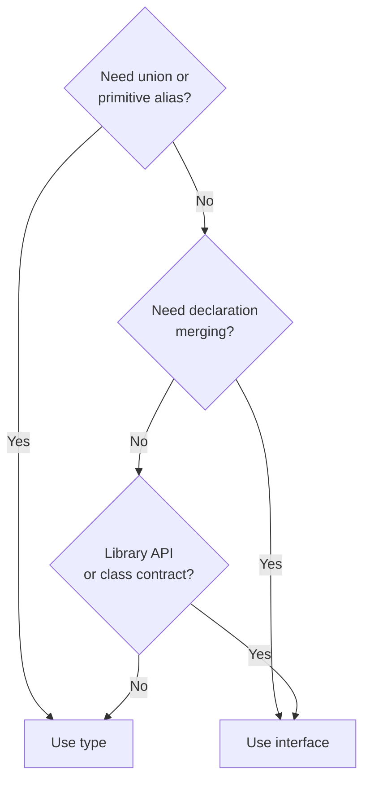

# Type vs Interface: My Rule

**Default to `type`. Use `interface` when you need declaration merging or a library-style API.**

That's it. Everything else is noise.

---

## Why I default to `type`

Works for primitives, unions, tuples — things `interface` can't do:

```ts
type ID = string | number;
type Status = 'active' | 'inactive';
type UserOrAdmin = User | Admin;
```

## When I use `interface`

**Declaration merging** — extending types defined elsewhere (e.g. third-party library augmentation):

```ts
// Extend Express Request globally
interface Request {
  user?: User;
}
```

**Class contracts** — `implements` reads more naturally with `interface`:

```ts
interface Serializable {
  serialize(): string;
}
class Config implements Serializable { ... }
```

---

## Quick comparison

| | `type` | `interface` |
|--|--|--|
| Primitives / unions | Yes | No |
| Declaration merging | No | Yes |
| Extending | Via `&` intersection | Native `extends` |
| `implements` (class) | Works | Works |

---

## Decision flowchart



---

## Bottom line

If you're unsure: use `type`. You can always change it later.

---

## Reference

- [TypeScript Handbook — Differences Between Type Aliases and Interfaces](https://www.typescriptlang.org/docs/handbook/2/everyday-types.html#differences-between-type-aliases-and-interfaces)
