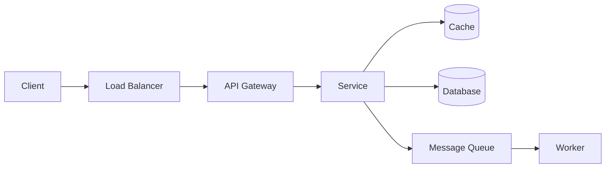

# My System Design Approach

System design interviews and real system design are different. These are my notes for both.

---

## How I approach a design problem

1. **Clarify before designing.** What's the scale? Read-heavy or write-heavy? Consistency or availability? Latency requirement? Who are the users? Most design mistakes come from skipping this.

2. **Start with the simplest thing that could work.** A single server with a database is a valid starting point. Then identify where it breaks.

3. **Identify bottlenecks, then add complexity.** Don't add a cache, queue, or CDN because they're cool — add them when you can explain exactly what problem they solve.

4. **Think in layers:**

   - Where does each request go? Where could it fail?

5. **Make trade-offs explicit.** SQL vs NoSQL, consistency vs availability, monolith vs microservices — there's no right answer, only the right trade-off for the context.

---

## Components and when I'd use them

| Component | When it's justified |
|-----------|---------------------|
| Load Balancer | Multiple instances, need to distribute traffic |
| CDN | Static assets, global users, latency matters |
| Cache (Redis) | Read-heavy, data doesn't change often, DB is a bottleneck |
| Message Queue | Async processing, decoupling producers/consumers, spikes |
| Database sharding | Single DB can't handle write volume |
| Read replicas | Read-heavy, single primary DB is a bottleneck |
| API Gateway | Multiple services, need centralized auth/rate-limiting |

---

## Numbers I keep in mind

- DB read: ~1ms (index hit), ~10ms (full scan)
- Cache read: ~0.1ms
- Network round trip (same region): ~1ms
- 1M requests/day ≈ 12 req/sec (roughly)
- A single DB handles ~1,000–10,000 QPS depending on query complexity

---

## Interview format (what I follow)

1. Requirements (5 min): functional + non-functional, scale estimate
2. High-level design (10 min): major components and data flow
3. Deep dive (15 min): pick the hardest part and go deep
4. Trade-offs (5 min): what would you do differently at 10x scale?

---

## Reference

- [roadmap.sh/system-design](https://roadmap.sh/system-design) — good starting overview
