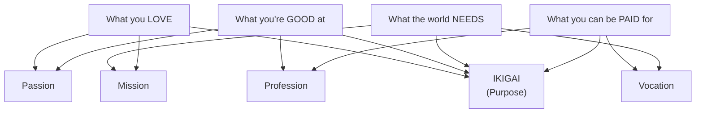

# 7 Techniques to Overcome Laziness

Seven principles from Japanese/Okinawan life philosophy that I keep coming back to when I'm stuck in low-energy loops.

## The Ikigai Center

The overlap of all four is where you find work that doesn't feel like work. Okinawans who have a strong ikigai live measurably longer — the concept is tied to lower all-cause mortality in longitudinal studies ([Sone et al., 2008](https://pubmed.ncbi.nlm.nih.gov/18828435/)).

---

## The 7 Techniques

### 1. Ikigai (Life Purpose)
Find the overlap above. What makes you want to get out of bed?

**My use:** When I feel like I'm just grinding through tasks, I ask: "Is this aligned with what I actually want to build?" If the answer is no for long enough, I reorient.

---

### 2. Kaizen (Continuous Improvement)
Small daily improvements compound. 1% better every day = 37x better in a year.

**My use:** I don't aim to read the whole book. I aim to read for 20 minutes. I don't aim to fix the whole codebase. I aim to make one thing cleaner today.

---

### 3. Pomodoro Technique (Time Management)
25 minutes focused work, 5 minute break. After 4 cycles, take a longer break.

**My use:** I run Pomodoro sessions for deep work (writing, coding features). The forced break stops me from burning out in a 4-hour flow state and then being useless for the rest of the day. ([Cirillo, F. — The Pomodoro Technique, 1987](https://francescocirillo.com/products/the-pomodoro-technique))

---

### 4. Eat Until 80% Full (Hara Hachi Bu)
Okinawan practice of stopping before you're completely full.

**My use:** I eat slowly enough to notice the satiation signal. Overeating reliably kills my afternoon focus — blood goes to digestion, brain slows down. This is the most physiologically grounded technique on the list. ([Willcox et al., 2007 — Caloric Restriction and Okinawan Longevity](https://pubmed.ncbi.nlm.nih.gov/17986602/))

---

### 5. Beginner's Mind (Shoshin)
Approach familiar things with fresh curiosity.

**My use:** When I'm bored of a technology, I try to re-examine why it works the way it does — read the spec, read the source code. Usually I find something I missed before. Boredom is often just premature closure.

---

### 6. Wabi-Sabi (Embracing Imperfection)
Done is better than perfect. Find beauty in the rough and unfinished.

**My use:** I ship, then improve. The temptation in engineering is to not release until it's perfect. Wabi-sabi is the philosophical backing for "just ship it and iterate". Perfectionism is procrastination with a positive self-image.

---

### 7. Household Financial Ledger
Track where your money goes. Financial clarity reduces background stress.

**My use:** Monthly expense review in a simple spreadsheet. Knowing the numbers removes the ambient anxiety of "am I spending too much?" — I either am, or I'm not, and I can see it clearly.

---

## Which ones I actually use daily

| Technique | Frequency | Biggest impact for me |
|-----------|-----------|----------------------|
| Pomodoro | Daily (deep work) | Prevents 3-hour doom scrolling sessions |
| Hara Hachi Bu | Most meals | Afternoon energy levels |
| Kaizen | Daily (micro-goals) | Removes the paralysis of big goals |
| Wabi-Sabi | When shipping | Overcoming perfectionism |

---

## Sources

- [Sone et al. (2008) — Sense of Life Worth Living and Mortality](https://pubmed.ncbi.nlm.nih.gov/18828435/), *Psychosomatic Medicine*
- [Willcox et al. (2007) — Caloric Restriction, the Traditional Okinawan Diet, and Healthy Aging](https://pubmed.ncbi.nlm.nih.gov/17986602/), *Annals of the New York Academy of Sciences*
- [Francesco Cirillo — The Pomodoro Technique](https://francescocirillo.com/products/the-pomodoro-technique)
