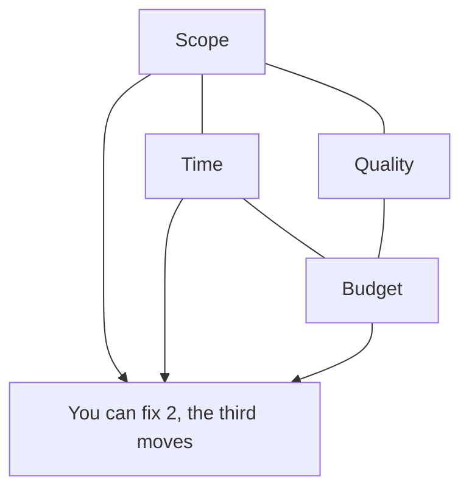
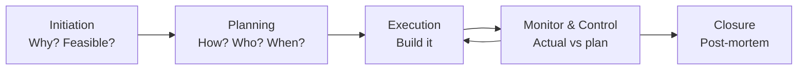

# Project Management

My working notes on running projects — what I've seen work, what the frameworks actually mean in practice.

---

## The Iron Triangle

**Reality check:** Every project I've been on has had someone try to hold all three fixed. It never works. Pick which constraint is actually sacred and be explicit about it upfront. Usually it's time (deadline) or scope (must-haves), rarely budget.

Additional constraints that get ignored: **Risk**, **Resources**, **Quality** (sometimes traded for speed).

---

## The Lifecycle

What actually matters at each stage:

| Stage | What I focus on | What gets skipped (mistake) |
|-------|-----------------|-----------------------------|
| Initiation | Who decides what, and is this scoped right? | Validating the problem before building |
| Planning | Dependencies and critical path | Risk register |
| Execution | Daily blockers, not just status | Flagging scope creep early |
| Monitor | Is actual timeline drifting? Re-plan if yes | People pretend they're on track |
| Closure | What would I do differently? | Actually happens — post-mortems skipped |

---

## RACI — Who Decides What

For any non-trivial deliverable, someone should be able to point to this table:

| Role | Meaning | Rule |
|------|---------|------|
| **R** — Responsible | Does the work | Can be multiple people |
| **A** — Accountable | Owns the outcome | Must be exactly ONE person |
| **C** — Consulted | Input before decision | Two-way communication |
| **I** — Informed | Notified of outcome | One-way communication |

**Most common mistake:** Multiple people are Accountable → no one is. If "the team" owns it, no one does.

---

## How I Run a Project (Personal Approach)

1. **Write the brief first** — one page: goal, non-goals, success metric, deadline, owner
2. **Map dependencies before scheduling** — who is blocked by who before I make any timeline
3. **Flag risk in week 1** — surface concerns early, before they become blockers
4. **Weekly check: is our timeline still realistic?** — re-plan early, not when it's too late
5. **Post-mortem every project, even small ones** — the learnings from things that went wrong are worth more than the ones that went right

---

## Reference

- [Agile Manifesto](https://agilemanifesto.org/)
- [PMBOK Guide — PMI](https://www.pmi.org/pmbok-guide-standards)
