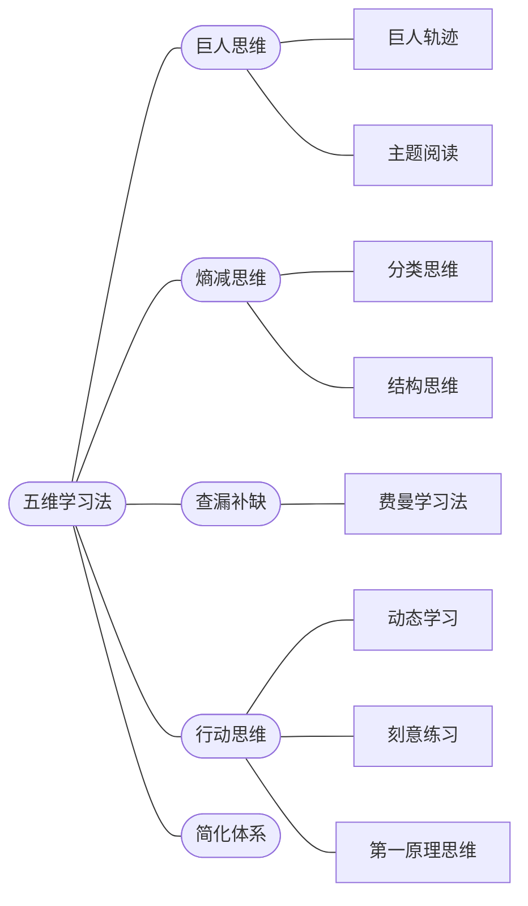

# 五维学习法

How to become an expert in any field, fast.

The framework: **5 dimensions of learning**, each with its own method.

---

## The 5 Dimensions

**1. 巨人思维 (Giant's Thinking)** — Learn from people who've already done it.
- 巨人轨迹: Trace the path of experts. Don't reinvent the map.
- 主题阅读: Read multiple sources on the same topic to triangulate truth.

**2. 熵减思维 (Entropy Reduction)** — Bring order to complexity.
- 分类思维: Categorize what you learn. Unstructured knowledge decays.
- 结构思维: Build mental frameworks. A schema makes new info stick.

**3. 查漏补缺 (Gap Filling)** — Find and close the holes.
- 费曼学习法: Teach it simply. If you can't explain it clearly, you don't know it.

**4. 行动思维 (Action)** — Learn by doing, not just reading.
- 动态学习: Apply as you learn. Side projects, experiments, real usage.
- 刻意练习: Deliberate practice on weak spots, not just what you're already good at.
- 第一原理思维: Break things down to fundamentals. Build understanding from ground up.

**5. 简化体系 (Simplification)** — Compress what you know into portable mental models.

---

## How I apply this

When learning a new technology:
1. Find 2–3 senior engineers who use it well (巨人轨迹) — watch talks, read their blog posts
2. Read the official docs + one community guide to triangulate (主题阅读)
3. Build something small with it immediately (动态学习)
4. Try to explain it to someone else or write it here (费曼)
5. Identify the 20% of knowledge that covers 80% of use cases — simplify to that (简化体系)

---

## Reference

- [前瞻网 original article](https://t.qianzhan.com/daka/detail/210817-c61ae77e.html)
- [The Feynman Technique — Cal Newport writeup](https://calnewport.com/blog/2012/10/26/mastering-linear-algebra-in-10-days-astounding-experiments-in-ultra-learning/)
- [Deliberate Practice — K. Anders Ericsson (1993)](https://doi.org/10.1037/0033-295X.100.3.363) — the science behind 刻意练习
- [Make It Stick: The Science of Successful Learning — Brown, Roediger, McDaniel (2014)](https://www.hup.harvard.edu/catalog.php?isbn=9780674729018) — backs up 查漏补缺 and spaced retrieval
